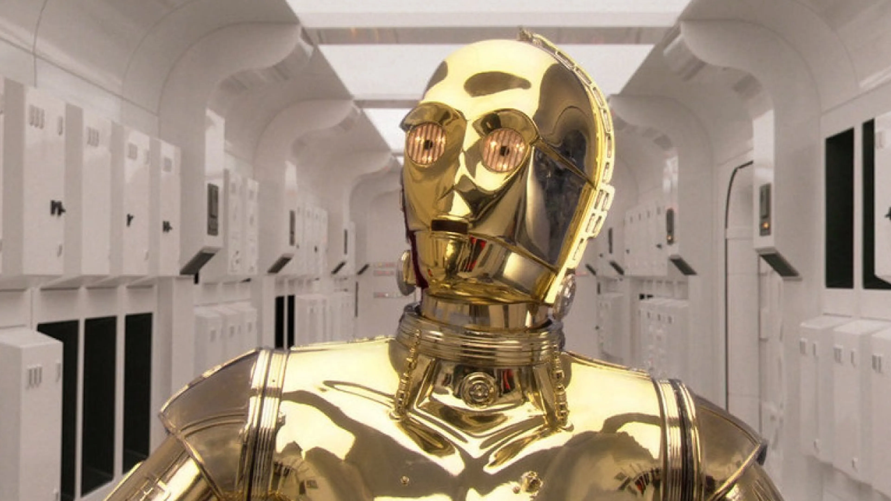

```{r}
html_tag_audio <- function(file, type = c("wav")) {
  type <- match.arg(type)
  htmltools::tags$audio(
    controls = "",
    htmltools::tags$source(
      src = file,
      type = glue::glue("audio/{type}", type = type)
    )
  )
}
```

{width=100% fig-align=center}

In my last blog post [*Installing the MBROLA speech synthesiser*](/blog/pymbrola-installation/pymbrola-installation.qmd), I suggested some steps to **install the MBROLA speech synthesiser** in **Ubuntu** and **Windows Subsystem for Linux (WSL)**, together with its available voices. I'll explain how to use **pymbrola**, a Python module that provides a programmatic interface to MBROLA.

**pymbrola** provides certain benefits, compared to calling MBROLA from the terminal. First, while some Python users are familiar with [**bash**](https://es.wikipedia.org/wiki/Bash) (the programming language used to interact with the Linux kernel), many other users are not. Getting MBROLA to work using the terminal can take a while, especially if one wants to fine-tune some parameters like phoneme duration or pitch contours. If one needs to generate many audios, calling MBROLA commands for each one of the audios is quite inefficient, but its alternative---calling MBROLA using for loops---requires some bash programming abilities that some may not have the time to acquire.

I made **pymbrola** with the intention of providing an intermediate point, in which the Python user can call MBROLA commands from the Python console. This way, manipulating parameters or using for loops can be done **within Python**. Here, I will illustrate some use cases for **pymbrola**.


## Installing pymbrola

The module **pymbrola** can be installed from [PyPi](https://pypi.org/project/mbrola/) under the name `mbrola`:

```bash
pip install mbrola
```

::: {.callout-warning collapse="true"}
Remember, I assume that you are using Ubuntu (other Linux distros may be compatible as well, but I have not tested them) or Windows Subsystem for Linux (WSL), and have installed MBROLA in your system (see [my previous blog post](/blog/pymbrola-installation/pymbrola-installation.qmd)). In case you know your way around Docker, I made a [Docker image](https://hub.docker.com/repository/docker/gongcastro/mbrola/general) for convenience.
:::

## Phonological symbols

Let's say we want to synthesise the Italian word ***caffè*** using the `it4` Italian voice. Our first task is to **transcribe the phonological form** of the word into a **phonological transcript** that MBROLA can understand. Each MBROLA voice comes with an associated README file that descibes the voice it self, and also provides the symbols the authors used to transcribe the pre-recorded diphones. This way, using those symbols will result in the appriate diphone being retrieved. Taking a look at the `it4` voice [README file](https://github.com/numediart/MBROLA-voices/blob/master/data/it4/README.txt):

```
i	spinoso		s p i n o1 s o
e	veloce		v e l o1 tS e
E	belpaese	b E l p a e1 z e
a	vaiolo		v a j O1 l o
o	polsino		p o l s i1 n o
O	norditalia	n O r d i t a1 l i a
u	puntale		p u n t a1 l e

i1      così            k o s i1
e1      mercé           m e r tS e1
E1      caffè           k a f f E1
a1      bontà           b o n t a1
o1	Roma		r o1 m a
O1      però            p e r O1
u1      più             p j u1

j	piume		p j u1 m e
w	quando		k w a1 n d o

p	pera		p e1 r a
t	torre		t o1 r r e
k	caldo		k a1 l d o
b	botte		b o1 t t e
d	dente		d E1 n t e
g	gatto		g a1 t t o

f	faro		f a1 r o
s	sole		s o1 l e
S	sci		S i1
v	via		v i1 a
z	peso		p e1 s o
Z	garage		g a r a1 Z

ts	pizza		p i1 ts ts a
tS	pece		p e1 tS e
dz	zero		dz E1 r o
dZ	magia		m a dZ i1 a

m	mano		m a1 n o
n	nave		n a1 v e
J	legna		l e1 J J a
nf	anfora		a1 nf f o r a
ng	ingordo		i ng g o1 r d o

l	palo		p a1 l o
L	soglia		s O1 L L a
r	remo		r E1 m o

_	PAUSE
```

The authors note that this set of symbols is aligned with the [SAMPA](https://es.wikipedia.org/wiki/SAMPA) transcription system, which makes it a bit more predictable. They also provide some nice example to illustrate the phoneme that eah symbol refers to. Now we know we transcibe our word *caffè* as `k a f f E1`^[This particular word is one of the examples provided by the authors, which is reassuring]. Let's now implement this transciption using **pymbrola**.

## MBROLA class

The main feature of the **pymbrola** module is the `MBROLA` class, which we can call specifying the word label (`caffè`), the list of phonmees to be played (`k a f f E1`).

```python
import mbrola

# Create an MBROLA object
caffe = mbrola.MBROLA(
    word="caffè",
    phon=["k", "a", "f", "f", "E1"],
)

# Display phoneme sequence
print(caffe)
```

This is what we get when printing the MBROLA object:

```
MBROLA object for word 'caffè':
; caffè
_ 1
k 100 200 200
a 100 200 200
f 100 200 200
f 100 200 200
E1 100 200 200
_ 1
```

This is a printed representation of the **PHO file** (.pho) which MBROLA will use to synthesise the word under the hood. Normally, one would manually write such a file, but **pymbrola** generates it automatically using the arguments passed to the instance of `MBROLA`. We can export this PHO file using the `export_pho()` method:

```python
# Export PHO file
house.export_pho("caffe.pho")
```

Inspecting this file, we can see that line **comments are specified with the `;` character**^[Weird choice if you ask me. Luckily for you, you did not, in fact, ask me so I won't say anything.]. **pymbrola** prints the word label in this first line, as a comment---it's easier to read the word label than figuring it out from the phonological symbols that follow.

In the next few lines, we define the actual **sounds** that MBROLA will synthesise, specified *sequentially* in different rows. We first have a **pause symbol** (`_`). This symbol is universal for all MBROLA languages. **MBROLA needs a silence before and after the other symbols**^[I reached this conclusion after unsuccessfully trying to synthesise words in different languages without such silences.]. **The first character after each symbol corresponds to the duration of its associated sound in milliseconds**. We are specifying the duration of this onset silence as a default value of 1 millisecond, which is imperceptible by the human ear, making it equivalent to almost no silence at onset. Same goes for the offset silence at the end of the document.

In the middle, we have several symbols corresponding to the **phonemes** that make up the word *caffè* in Italian: `k`, `a`, `f`, `f`, `E1`. Again, after each symbol we specify its duration. Since we did not specify otherwise, **the duration of each phoneme is assigned 100 milliseconds by default**. In next examples we will adjust this parameter at will. The two numbers that follow indicate the **pitch contour** inside the phoneme---how the pitch increases and decreases within each sound. Again, we are leaving the default options: the pitch starts and ends at 200 Hz with no changes in the middle.

## Synthesising a sound

The resulting MBROLA object we created is all MBROLA needs to **synthesise the sounds** we want. Let's do it:

```python
# Synthesize and save audio (WAV file)
caffe.make_sound("caffe.wav", voice="it4")
```

```{r}
#| label: caffe-example
html_tag_audio("sounds/caffe.wav", type = "wav")
```

As expected, it sounds quite robotic. But the reason we are interested in using MBROLA is not so much how it sounds (more recent tools produce much more natural results), but the fact that we can manipulate quite flexibly the features of each phoneme. **pymbrola** makes this quite convenient.

## Manipulating duration

We can shorten or lengthen the whole **audio duration** by a constant (all sounds are modified equally) using the `dur_ratio` argument in the `make_sound()` method. A value of `1.0` leaves the audio unnmodified. Smaller values shorten the audio duration:

```python
# cut audio duration by half
caffe.make_sound("caffe-short.wav", voice="it4", dur_ratio=0.5)
```

```{r}
#| label: audio-short
html_tag_audio("sounds/caffe-short.wav", type = "wav")
```

Meanwhile, larger values lengthen the audio duration:

```python
# souble audio duration
caffe.make_sound("caffe-long.wav", voice="it4", dur_ratio=2.0)
```

```{r}
#| label: audio-long
html_tag_audio("sounds/caffe-long.wav", type = "wav")
```

To manipulate the individual duration of each phoneme, we need to specify it when create the MBROLA instance. We can do this by specifying a single positive integer in the `durations` argument, or a list of positive integer with same length as number of phonemes. The former option leads to all phonemes being given that same value. The latter, a list, assigns each duration to each phoneme:

```python
caffe = MBROLA(
    word="caffè",
    phon=["k", "a", "f", "f", "E1"],
    durations=[50, 200, 100, 100, 200] # or [100, 120, 100, 110]
)
```

Let's inspect the PHO output:

```
MBROLA object for word 'caffè':
; caffè
_ 1
k 50 200 200
a 200 200 200
f 100 200 200
f 100 200 200
E1 200 200 200
_ 1
```

As you see, we have lengthened the two vowels `a` and `E1`, shortened the onset phoneme `k` and left the rest of the phonemes `f` and `f` equal^[While we can lengthen or shorten phonemes at will, one should keep in ming that some phonemes, because of their articulatory/phonetic properties, are by nature shorter or longer when produced by a human speaker. In fact, speaking about duration is virtually only useful when talking about phonemes with high sonority (e.g., vowels, liquids). For instance, lengthening stop-consonants like /k/ and /p/ can lead to weird-sounding outputs. Try to produce a long /k/. Does it feel/sound natural? Make sure the durations you specify are informed by natural patters or by the hypotheses of your study!]. Let's see how it sounds, can you spot the difference?

```{r}
#| label: audio-durations
html_tag_audio("sounds/caffe-durations.wav", type = "wav")
```


## Manipulating pitch

We also have several methods to **alter the pitch contour of the word-form**. As we did before with duration, we can also modify the pitch of the whole word by a constant. Let's raise the pitch to 400 Hz (double):

```python
caffe.make_sound("caffe-high-pitch.wav", voice="it4", f0_ratio=2.0)
```

Now lets lower it to 100 Hz (half):

```python
caffe.make_sound("caffe-high-low.wav", voice="it4", f0_ratio=0.5)
```

More interestingly, **we can also modify the pitch contour of each phoneme**. As we did with duration, we can do it in two ways. First, we can provide a single positive integer in the `pitch` argument, which will be assigned to all phonemes:

```python
caffe = mbrola.MBROLA(
    word="caffè",
    phon=["k", "a", "f", "f", "E1"],
    pitch=300
)
```

```{r}
#| label: audio-pitch
html_tag_audio("sounds/caffe-pitch.wav", type = "wav")
```

We can also pass a **list of pitch values** of length equal to the number of phonemes:

```python
caffe = mbrola.MBROLA(
    word="caffè",
    phon=["k", "a", "f", "f", "E1"],
    pitch=[250, 250, 200, 200, 200]
)
```

Here we have passed a list of pitch values (in Hz) that make the first syllable have a higher pitch, compared to the second one. Can you hear the difference?

```{r}
#| label: audio-pitch-varying
html_tag_audio("sounds/caffe-pitch-varying.wav", type = "wav")
```

Finally, we can also pass a **list of embedded lists**, each of these would specify the pitch contour *within* each phoneme. For instance:

```python
caffe = mbrola.MBROLA(
    word="caffè",
    phon=["k", "a", "f", "f", "E1"],
    durations = [50, 200, 100, 100, 500],
    pitch=[250, 250, 200, 200, [200, 250, 300, 400]]
)
```

As you can see, we've specified **a list of values for the pitch of the last phoneme** `E1`: pitch starts at 200 Hz, continues at 250 Hz, 300 Hz, and finally, 44 Hz. The rest of the phonemes have the same values as in the previous example. I've also modified the duration of the last phoneme `E1` to 500 milliseconds to make the pith modulation easier to perceive. Under the hood, MBROLA will divide the time span of the last phoneme (500 ms) into $k$ equal intervals (where $k$ equals the number of values passed for the pitch contour of such phoneme), and change the pitch linear at each point by the corresponding value:

```{r}
#| label: audio-pitch-piecewise
html_tag_audio("sounds/caffe-pitch-piecewise.wav", type = "wav")
```

## Conclusion

**pymbrola** provides a convenient Python interface to MBROLA, which allows modifying the duration and pitch contour of particular phonemes by simplify specifying the arguments provided in during the creation of a MBROLA instance, or during the synthesis of the audio when calling the `make_sound()` method. This makes it easier for the average Python user to generate multiple MBROLA sounds in a programmatic, faster, and more reproducible way.
